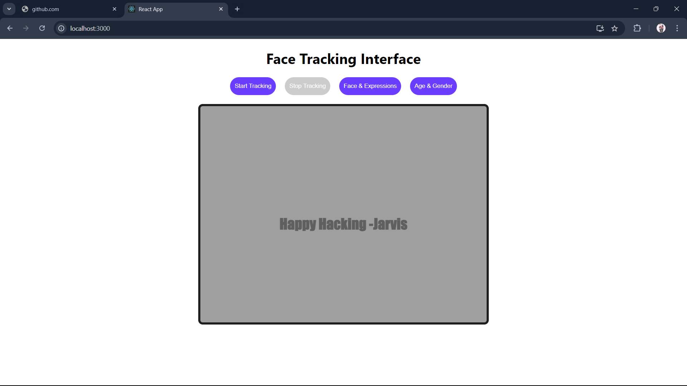

# Face Tracking Interface with Face API

This project is a React-based face tracking interface using **face-api.js**. It allows users to start and stop face tracking through a webcam and detect facial features, landmarks, and expressions. The detections are visualized on a canvas overlay placed on top of the video feed.

## Features

- **Face Detection**: Detects multiple faces in real time using the webcam.
- **Landmark Detection**: Detects 68 facial landmarks such as eyes, nose, and mouth.
- **Expression Detection**: Identifies facial expressions like happiness, sadness, surprise, etc.
- **Start/Stop Tracking**: Simple interface to start and stop the face tracking process.

## Demo



## Getting Started

### Prerequisites

- [Node.js](https://nodejs.org/) (v12+ recommended)
- [npm](https://www.npmjs.com/) or [yarn](https://yarnpkg.com/)

### Installing

1. Clone the repository:
   ```bash
   git clone https://github.com/praveenjadhav1510/face-Tracking.git
   cd face-Tracking
   ```

2. Install the dependencies:
   ```bash
   npm install
   ```

3. Download the **face-api.js** models:
   - Go to the [face-api.js models](https://github.com/justadudewhohacks/face-api.js/tree/master/weights) repository and download the following model files:
     - `tiny_face_detector_model-weights_manifest.json`
     - `face_landmark_68_model-weights_manifest.json`
     - `face_expression_model-weights_manifest.json`
   - Place these files in the `public/models` folder of your project:
     ```
     public/models
       ├── tiny_face_detector_model-weights_manifest.json
       ├── face_landmark_68_model-weights_manifest.json
       └── face_expression_model-weights_manifest.json
     ```

### Running the Project

1. Start the React app:
   ```bash
   npm start
   ```

2. Open the app in your browser at:
   ```
   http://localhost:3000
   ```

## Project Structure

```
src/
├── components/
│   └── FaceTracker.js       # Main face tracking component
├── FaceTracker.css          # CSS for styling the interface
├── App.js                   # Root React component
├── index.js                 # Entry point of the React app
public/
├── models/                  # Face-api.js model files
└── index.html               # Main HTML file
```

## How It Works

- The app uses **face-api.js** to load pre-trained models for detecting faces, facial landmarks, and facial expressions.
- The webcam feed is accessed using the `navigator.mediaDevices.getUserMedia()` API.
- Real-time face detection is performed by calling the `detectAllFaces()` function from **face-api.js**, and the results are drawn on a canvas element placed on top of the video feed.

## Technologies Used

- **React.js**: JavaScript library for building user interfaces.
- **face-api.js**: JavaScript API for real-time face detection and face analysis.
- **HTML5 Canvas**: For rendering detection results on top of the video feed.

## Screenshots

### Face Tracking in Action


## License

This project is licensed under the MIT License - see the [LICENSE](LICENSE) file for details.

## Acknowledgements

- [face-api.js](https://github.com/justadudewhohacks/face-api.js) for providing the face detection API.
  
---
